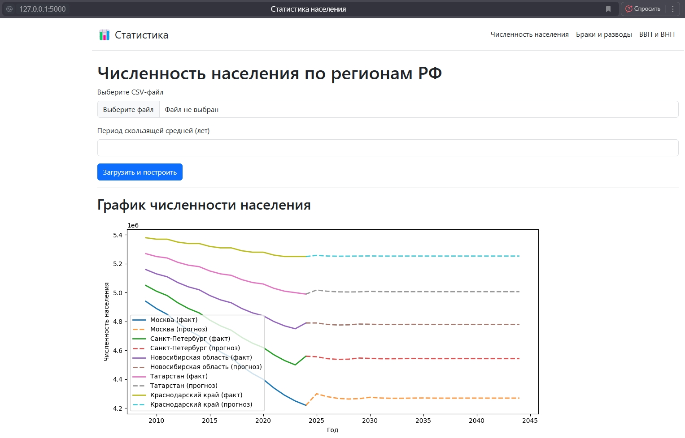
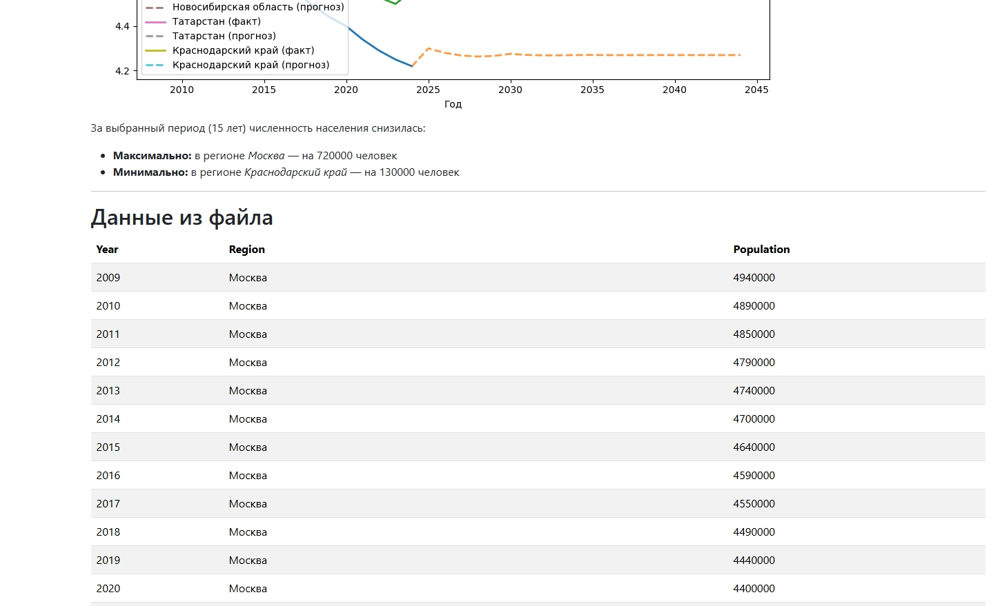

# Технологии программирования. **3-я лабораторная работа**

Выполнии: Мельник Я.П., Шендрик А.К., Исматов Ж.О.

## Функционал страницы

###  Численность насиления

- **Задание:** Пользователь открывает файл с данными о численности населении по субъектам в России за последние 15 лет. Вывести эту информацию на экран в удобном табличном формате. По этим данным построить графики зависимости от года. Вычислить в каком субъекте РФ за 15 лет численность снизилась больше всего, а в каком меньше всего (именно снизилась). Реализовать статистическое прогнозирование методом экстраполяции по скользящей средней на последующие N лет, вывести эту информацию на отдельном графике либо закрасить другим цветом на том же.

- **Формат входных данных:** ```Год (Year), Регион (Region), Population```
    
  	> *Пример:*
	>
  	> 2009,Москва,4940000
	>
	> 2010,Москва,4890000
	>
  > ...
   > 
   > 2017,Санкт-Петербург,4740000
   > 
	> ...

### ВВП и ВНП

- **Задание:** Пользователь открывает файл с данными о ВВП и ВНП России за последние 15 лет. Вывести эту информацию на экран в удобном табличном формате. По этим данным построить графики зависимости от года. Вычислить максимальный процент роста и падения за год. Реализовать статистическое прогнозирование методом экстраполяции по скользящей средней на последующие N лет, вывести эту информацию на отдельном графике либо закрасить другим цветом на том же.

- **Формат входных данных:** ```Год (Year), ВВП (VVP), ВНП (VNP)```
    
  	> *Пример:*
	>
  	> 2025,1400478,2196982
	>
	> 2024,1370983,2184213
	> 
  > 2023,1205842,2021293
  >
	> ...

**Пример работы:**
	

 **Пример работы:**
	
  
